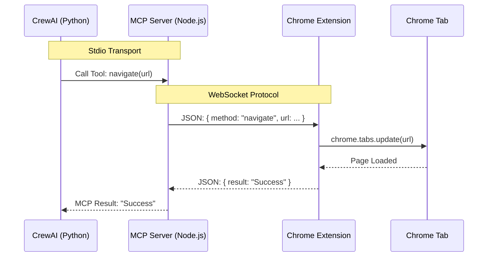

# Stealth-Stream Bridge: Architecture Reference

> **Project Identity**: The "Stealth-Stream Bridge" is a specialized toolchain designed to enable Agentic AI (CrewAI) to control a live, authenticated Chrome session via a custom Extension-to-MCP bridge.

## 1. Why We Built This (Justification)
Standard browser automation (Playwright/Selenium) calls often fail in modern agentic workflows because:
1.  **Detection**: "Clean" browser instances are easily flagged by anti-bot systems (Cloudflare, Akamai).
2.  **Auth Barriers**: Agents cannot easily bypass 2FA, CAPTCHAs, or complex SSO flows.
3.  **State Loss**: Every run starts from scratch, losing cookies and local storage.

**The Solution**:
Instead of launching a new browser, we "parasitize" the user's existing, authenticated Chrome session.
*   **Stealth**: Acts as the human user (same fingerprint, cookies, history).
*   **Persistence**: Authentication states are preserved.
*   **Control**: The agent sends high-level commands, which are executed by a trusted Chrome Extension.

## 2. System Architecture

The system uses a **Split-Process Architecture** to ensure stability.

### Components
1.  **Chrome Extension (Client)**:
    *   **Type**: Manifest V3.
    *   **Role**: The "Hands" inside the browser.
    *   **Communication**: Connects via WebSocket (`ws://localhost:8765`) to the Bridge Server.
    *   **Capabilities**: Executes DOM manipulation, navigation, and extraction in the active tab context.

2.  **MCP Server (Bridge)**:
    *   **Runtime**: **Node.js / TypeScript**.
    *   **Role**: The "Translator".
    *   **Transport**: Uses `Stdio` to talk to CrewAI and `WebSockets` to talk to the Extension.
    *   **Why Node.js?**: Chosen for its robust event loop and native WebSocket handling, resolving stability issues found with Python Stdio on Windows.

3.  **CrewAI Agent (Brain)**:
    *   **Runtime**: Python.
    *   **Role**: The "Decision Maker".
    *   **Integration**: Connects to the Bridge via the Standard MCP Stdio protocol.

### Data Flow

## 3. Technical Constraints & Decisions
*   **Manifest V3**: Required by Chrome. We use `chrome.scripting` and `activeTab` to maintain compliance while ensuring capability.
*   **Stdio Transport**: Chosen for security and simplicity (local pipe) over exposing HTTP ports for the Agent connection.
*   **Port 8765**: Reserved for the internal WebSocket bridge.

## 4. Setup Guide
1.  **Install Extension**: Load unpacked from `src/bridge/extension`.
2.  **Build Bridge**: `cd src/bridge && npm install && npm run build`.
3.  **Run Agent**: `python src/agents/test_agent.py`.
